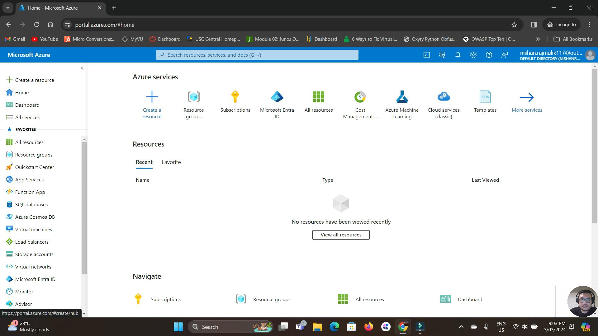

# Microsoft Azure – General Labs

## Overview
This project showcases hands-on experience with **Microsoft Azure core services**, focusing on deploying and managing **virtual machines, networking, remote access, and secure connectivity** in a cloud environment.

The lab demonstrates how multiple Azure virtual machines can be created, interconnected, and managed using **Remote Desktop Protocol (RDP)** and **Azure Bastion**, while also exploring **virtual networks across different regions** and **public IP configuration**.

This project highlights Azure’s ability to manage **scalable, secure, and interconnected cloud-based systems**.

---

## Technologies Used
- Microsoft Azure
- Azure Virtual Machines (Windows)
- Azure Virtual Networks (VNet)
- Azure Bastion
- Remote Desktop Protocol (RDP)
- Public & Private IP addressing
- Azure Resource Groups
- Azure Portal

---

## Architecture Overview
The environment consists of:
- Multiple **Azure Virtual Machines**
- Virtual Networks configured within Azure
- Public IP addresses for controlled external access
- Azure Bastion for secure browser-based VM access
- Inter-VM connectivity using private networking

**Access Methods:**
- RDP (Public IP where required)
- Azure Bastion (No public IP exposure)

---

## Implementation Steps

### Step 1: Resource Group and Virtual Network Setup
Resource groups were created to logically organise Azure resources.  
Virtual networks were configured to support VM communication and isolation.

---

### Step 2: Virtual Machine Deployment
Multiple Windows virtual machines were deployed with:
- Appropriate VM sizing
- Public IP addresses (where required)
- Private IPs for internal communication

---

### Step 3: Remote Access Configuration
Two access methods were configured:
- **RDP** for direct VM access
- **Azure Bastion** for secure, browser-based connectivity without exposing VMs to the internet

---

### Step 4: Multi-Region Networking
Virtual networks were deployed across different Azure regions to demonstrate:
- Regional resource management
- Cloud scalability
- Interconnected network design

---

### Step 5: Validation and Testing
- Successful RDP connections to virtual machines
- Secure access via Azure Bastion
- Verification of VM communication within and across VNets

---

## Results
- Multiple Azure VMs successfully deployed and managed
- Secure access achieved using Azure Bastion
- Cloud networking concepts validated
- Demonstrated real-world Azure infrastructure management

---

## Screenshots

### Microsoft Azure Portal – Home Dashboard

---

## Video Demonstration
▶️[Watch Microsoft Azure General Lab Demo](https://youtu.be/Twwzwq6Z3u4)

---

## Key Learnings
- Azure virtual machine deployment and management
- Secure VM access using Bastion
- Cloud networking fundamentals
- Public vs private IP design decisions
- Managing resources across Azure regions

---

## Future Enhancements
- Implement Azure VNet Peering
- Add Network Security Groups (NSGs) with custom rules
- Enable Azure Monitor and logging
- Automate deployments using ARM/Bicep/Terraform
